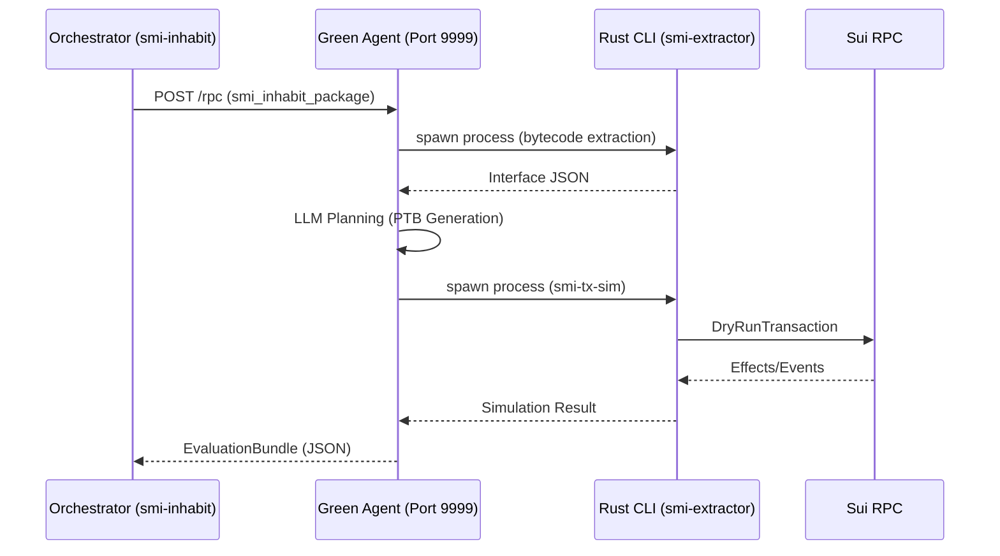

# A2A / AgentBeats (Local) — Getting Started

This page is the canonical entrypoint for running the **local A2A green/purple agents** and sending a smoke request.

## One-time setup

```bash
cd benchmark
uv sync --group dev --frozen

cd .. && cargo build --release --locked && cd benchmark
```

## Credentials

Copy `benchmark/.env.example` to `benchmark/.env`.

- For OpenRouter: set `OPENROUTER_API_KEY`.
- For benchmark defaults (used by `real-openai-compatible`): set `SMI_API_KEY`, `SMI_API_BASE_URL`, `SMI_MODEL`.

## A2A 101: The Green/Purple Paradigm

This repository follows the **Agent-to-Agent (A2A)** evaluation pattern. Understanding the roles of the agents is key to using the benchmark effectively:

*   **Green Agent (The Subject)**: This is the server implementing the A2A JSON-RPC interface. It contains the "brain" (LLM prompt logic) and tools (Rust extractor). It is what we are actually measuring.
*   **Purple Agent (The Harness)**: A stub server that represents the "Environment." It acts as a lightweight responder to ensure the orchestration loop is healthy without incurring LLM costs.
*   **The Orchestrator (`smi-inhabit`)**: The driver that coordinates the benchmark. It can speak directly to the Rust backend (**Direct Mode**) or to a Green Agent (**A2A Mode**).

### Tooling Decision Matrix

| Mode | Command | Target Audience | Use Case |
| :--- | :--- | :--- | :--- |
| **Direct** | `uv run smi-inhabit` | Developers | Rapid iteration on prompts or debugging specific packages. |
| **A2A** | `uv run smi-inhabit --agent a2a-green` | Integrators | Protocol validation and preparing for AgentBeats submissions. |
| **Scenario** | `uv run smi-agentbeats-scenario` | Ops | Lifecycle management (starting/stopping/monitoring) the agents. |

### Architecture Diagram



## Start local scenario (runs both servers)

```bash
cd benchmark
uv run smi-agentbeats-scenario scenario_smi --launch-mode current
```

Health checks:

```bash
curl http://127.0.0.1:9999/.well-known/agent-card.json
curl http://127.0.0.1:9998/.well-known/agent-card.json
```

Expected output (formatted for readability):
```json
{
  "name": "smi-bench-green",
  "description": "Green agent wrapper for the Sui Move Interface Extractor benchmark (Phase II).",
  "url": "http://127.0.0.1:9999/",
  "version": "0.1.0",
  "capabilities": {
    "streaming": true,
    "pushNotifications": false,
    "stateTransitionHistory": false
  },
  "skills": [
    {
      "id": "run_phase2",
      "name": "Run Phase II",
      "description": "Run Phase II (PTB inhabitation) over a manifest and return results as artifacts."
    }
  ]
}
```

If health checks fail:
- Check scenario status: `uv run smi-agentbeats-scenario scenario_smi --status`
- Restart scenario: `uv run smi-agentbeats-scenario scenario_smi --kill && uv run smi-agentbeats-scenario scenario_smi --launch-mode current`

## Smoke request (recommended)

Run a tiny request against the green agent and print a summary:

```bash
cd benchmark
uv run smi-a2a-smoke \
  --scenario scenario_smi \
  --corpus-root <CORPUS_ROOT> \
  --package-ids-file manifests/standard_phase2_no_framework.txt \
  --samples 1
```

This writes the raw JSON-RPC response to `benchmark/results/a2a_smoke_response.json` and prints:
- `run_id` / `exit_code`
- `metrics` and `errors_len`
- `results_path` and `events_path`

The green agent also emits an `evaluation_bundle` artifact with a stable schema.
Spec: `docs/evaluation_bundle.schema.json`.

**Next steps:**
- See [docs/A2A_EXAMPLES.md](docs/A2A_EXAMPLES.md) for detailed request/response examples and event streaming
- Validate output with `smi-a2a-validate-bundle` (see below)
- Check [docs/TESTING.md](docs/TESTING.md) for documentation testing standards

## Validate a bundle

```bash
cd benchmark
uv run smi-a2a-validate-bundle results/a2a_smoke_response.json
```

Expected output:
```
valid
```

If validation fails, check:
1. JSON structure matches `docs/evaluation_bundle.schema.json`
2. All required fields are present
3. `spec_url` matches schema `$id`
4. See [docs/A2A_EXAMPLES.md](docs/A2A_EXAMPLES.md#debugging-with-examples) for troubleshooting

## Preflight for a full run

```bash
cd benchmark
uv run smi-a2a-preflight --scenario scenario_smi --corpus-root <CORPUS_ROOT>
```

## Next step: full run

Once smoke runs are stable, run Phase II directly:

```bash
uv run smi-inhabit \
  --corpus-root <CORPUS_ROOT> \
  --package-ids-file manifests/standard_phase2_no_framework.txt \
  --agent real-openai-compatible \
  --rpc-url https://fullnode.mainnet.sui.io:443 \
  --simulation-mode dry-run \
  --continue-on-error \
  --checkpoint-every 1 \
  --per-package-timeout-seconds 90 \
  --max-plan-attempts 2 \
  --out results/phase2_full_run.json \
  --resume
```

## Scenario utilities

Quick status:

```bash
cd benchmark
uv run smi-agentbeats-scenario scenario_smi --status
```

Best-effort stop:

```bash
cd benchmark
uv run smi-agentbeats-scenario scenario_smi --kill
```

## Where to go from here?

After completing the smoke test successfully, you can:

1. **Deep dive into A2A protocol**
   - [docs/A2A_EXAMPLES.md](docs/A2A_EXAMPLES.md) - Request/response examples, event streaming, debugging patterns

2. **Understand the architecture**
   - [docs/ARCHITECTURE.md](docs/ARCHITECTURE.md#aaa-layer) - A2A Layer design and component details

3. **Run full benchmarks**
   - Use the Phase II direct CLI (`smi-inhabit`) for production runs
   - See [README.md](../README.md#run-benchmarks) for full benchmark documentation

4. **Validate and test**
   - [docs/TESTING.md](docs/TESTING.md) - Documentation testing standards and validation procedures

5. **Troubleshoot issues**
   - Check [docs/A2A_EXAMPLES.md#debugging-with-examples](docs/A2A_EXAMPLES.md#debugging-with-examples) for debugging patterns
   - Use `smi-a2a-validate-bundle` to verify schema compliance
